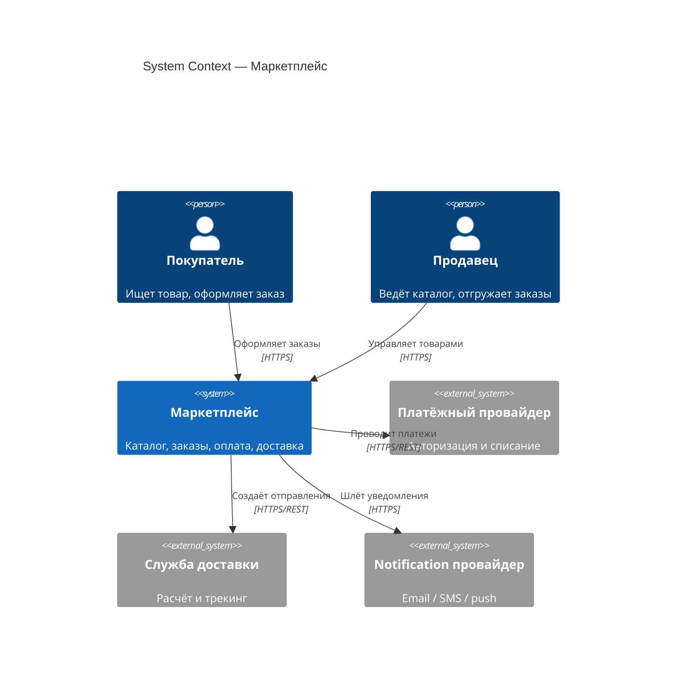

```mermaid
    C4Context
    title System Context — Маркетплейс
    
        Person(buyer, "Покупатель", "Ищет товар, оформляет заказ")
        Person(seller, "Продавец", "Ведёт каталог, отгружает заказы")
    
        System(mp, "Маркетплейс", "Каталог, заказы, оплата, доставка")
    
        System_Ext(psp, "Платёжный провайдер", "Авторизация и списание")
        System_Ext(delivery, "Служба доставки", "Расчёт и трекинг")
        System_Ext(notify, "Notification провайдер", "Email / SMS / push")
    
        Rel(buyer, mp, "Оформляет заказы", "HTTPS")
        Rel(seller, mp, "Управляет товарами", "HTTPS")
        Rel(mp, psp, "Проводит платежи", "HTTPS/REST")
        Rel(mp, delivery, "Создаёт отправления", "HTTPS/REST")
        Rel(mp, notify, "Шлёт уведомления", "HTTPS")
```
