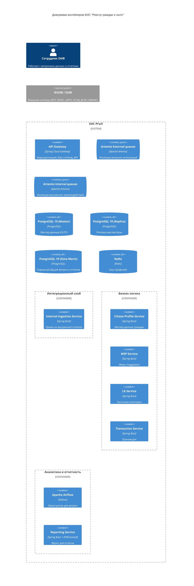

```mermaid
C4Container
    title Диаграмма контейнеров ЕИС "Реестр граждан и льгот"

    Person(operator, "Сотрудник ОИВ", "Работает с витринами данных и отчетами")
    
    System_Ext(foiv, "ФОИВ / ОИВ", "Внешние системы (ЕРН, ФИАС, мЕРН, НСУД, ДСЗН, ЕМИАС)")

    System_Boundary(eis_boundary, "ЕИС РГиЛ") {
        Container(gateway, "API Gateway", "Spring Cloud Gateway", "Маршрутизация, Rate Limiting, JWT")
        
        Container_Boundary(integration, "Интеграционный слой") {
            Container(int_ingestion, "Internal Ingestion Service", "Spring Boot", "Прием из внутреннего Artemis")
        }
        
        Container_Boundary(core, "Бизнес-логика") {
            Container(profile, "Citizen Profile Service", "Spring Boot", "Мастер-данные граждан")
            Container(msp, "MSP Service", "Spring Boot", "Меры поддержки")
            Container(lk, "LK Service", "Spring Boot", "Льготные категории")
            Container(tx, "Transaction Service", "Spring Boot", "Транзакции")
        }
        
        Container_Boundary(analytics, "Аналитика и отчетность") {
            Container(airflow, "Apache Airflow", "Python", "Оркестратор для витрин")
            Container(report, "Reporting Service", "Spring Boot + PHP(Laravel)", "Фронт для отчетов")
        }
        
        ContainerQueue(artemis_ext, "Artemis External queues", "Apache Artemis", "Изоляция внешних интеграций")
        ContainerQueue(artemis_int, "Artemis Internal queues", "Apache Artemis", "Изоляция внутренних взаимодействий")
        
        ContainerDb(pg_master, "PostgreSQL 19 (Master)", "PostgreSQL", "Мастер-данные (OLTP)")
        ContainerDb(pg_replica, "PostgreSQL 19 (Replica)", "PostgreSQL", "Реплика мастер-базы")
        ContainerDb(pg_dm, "PostgreSQL 19 (Data Marts)", "PostgreSQL", "Отдельная БД для витрин и отчетов")
        ContainerDb(redis, "Redis", "Redis", "Кэш профилей")
    }
```
