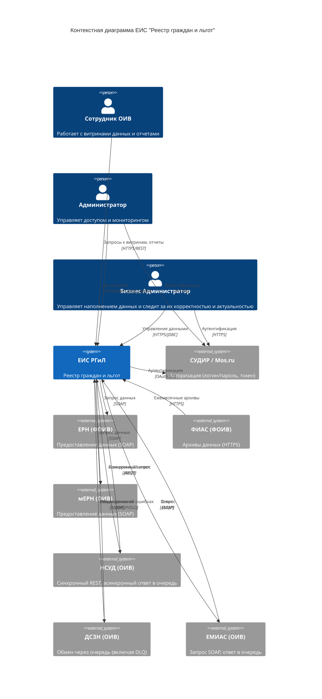

```mermaid
    C4Context
        title Контекстная диаграмма ЕИС "Реестр граждан и льгот"
    
        Person(operator, "Сотрудник ОИВ", "Работает с витринами данных и отчетами")
        Person(admin, "Администратор", "Управляет доступом и мониторингом")
        Person(businessAdmin, "Бизнес Администратор", "Управляет наполнением данных и следит за их корректностью и актуальностью")
    
        System(eis, "ЕИС РГиЛ", "Реестр граждан и льгот")
    
        System_Ext(sudir, "СУДИР / Mos.ru", "Авторизация (логин/пароль, токен)")
        System_Ext(ern, "ЕРН (ФОИВ)", "Предоставление данных (SOAP)")
        System_Ext(fias, "ФИАС (ФОИВ)", "Архивы данных (HTTPS)")
        System_Ext(mern, "мЕРН (ОИВ)", "Предоставление данных (SOAP)")
        System_Ext(nsud, "НСУД (ОИВ)", "Синхронный REST, асинхронный ответ в очередь")
        System_Ext(dszn, "ДСЗН (ОИВ)", "Обмен через очередь (включая DLQ)")
        System_Ext(emias, "ЕМИАС (ОИВ)", "Запрос SOAP, ответ в очередь")
    
        Rel(operator, eis, "Запросы к витринам, отчеты", "HTTPS/REST")
        Rel(admin, eis, "Мониторинг", "HTTPS/REST/JDBC/AMQP")
        Rel(businessAdmin, eis, "Управление данными", "HTTPS/JDBC")
        
        Rel(admin, sudir, "Аутентификация", "HTTPS")
        Rel(businessAdmin, sudir, "Аутентификация", "HTTPS")
        
        Rel(eis, sudir, "Аутентификация", "OAuth 2.0")
        Rel(eis, ern, "Запрос данных", "SOAP")
        Rel(fias, eis, "Ежемесячные архивы", "HTTPS")
        Rel(eis, mern, "Запрос данных", "SOAP")
        
        Rel(eis, nsud, "Синхронный запрос", "REST")
        Rel(nsud, eis, "Асинхронный ответ", "AMQP")
        
        Rel(eis, dszn, "Обмен данными", "AMQP")
        Rel(dszn, eis, "Уведомления об ошибках", "AMQP/DLQ")
        
        Rel(eis, emias, "Запрос", "SOAP")
        Rel(emias, eis, "Ответ", "AMQP")
```
